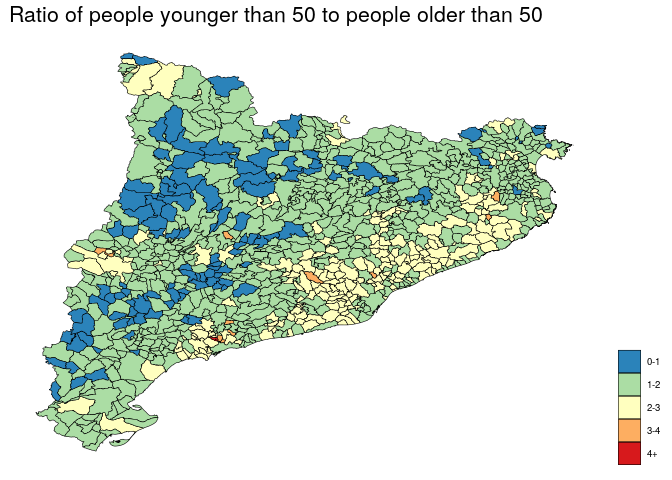
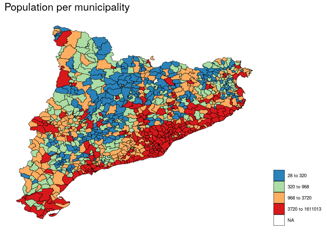
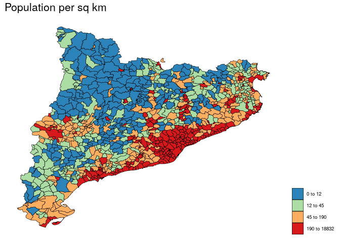
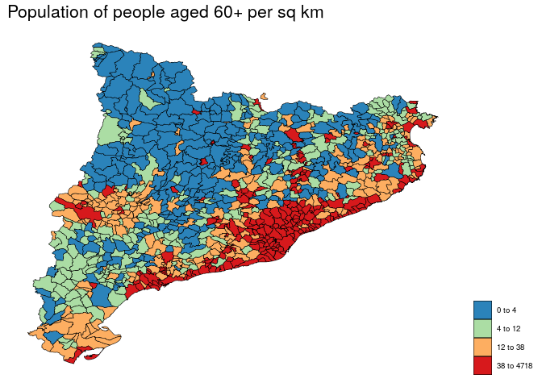
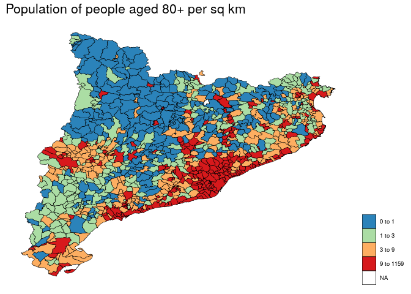
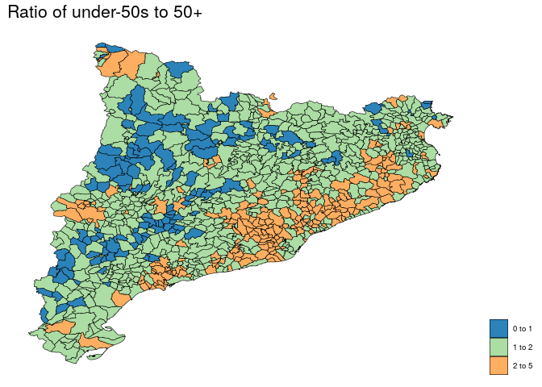
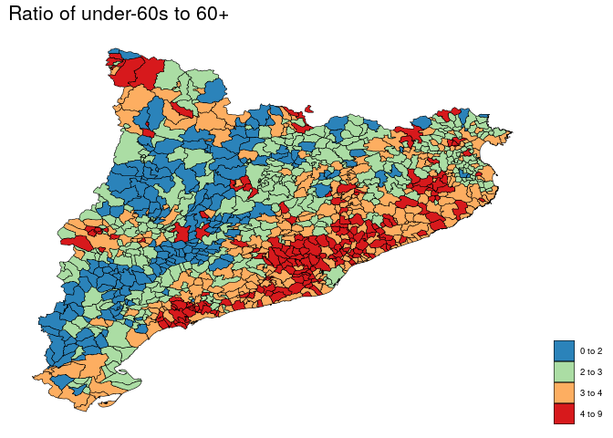
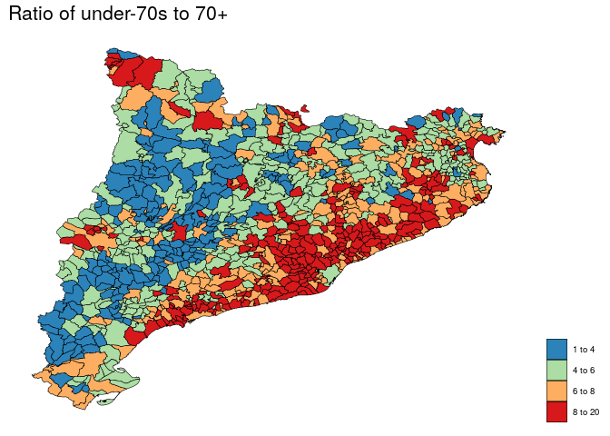
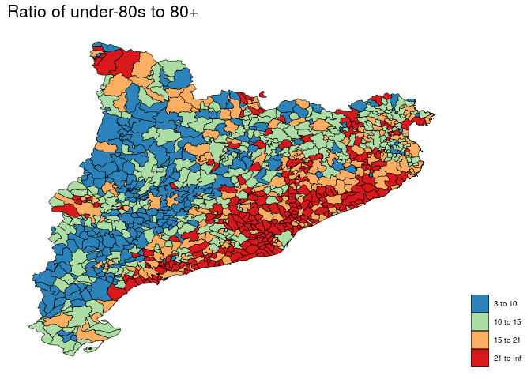

<!-- README.md is generated from README.Rmd. Please edit that file -->

# Tango

Chaccour and Brew

<!-- badges: start -->

[](https://www.tidyverse.org/lifecycle/#experimental)
<!-- badges: end -->

``` r
# Load the package for this project
library(tango)
# Load other useful packages
library(knitr)
library(tidyr)
library(dplyr)
library(sp)
library(ggplot2)
library(RColorBrewer)

# Get census age data
census <- tango::census
# Get municipios spatial data
municipios <- tango::municipios


# Get census age data
census <- diadespres::census
#43 = Tarragona
#08 = Barcelona
#25 = Lleida
#17 = Girona
catalan_codes <- c('43', '08', '25', '17')
census <- census %>%
  filter(substr(id, 1, 2) %in% catalan_codes)

# Get municipios spatial data
municipios <- diadespres::municipios
municipios <- municipios[substr(municipios@data$id, 1, 2) %in% catalan_codes, ]

# Order census by pop
by_pop <- census %>%
  group_by(id, municipio) %>%
  summarise(pop = sum(total, na.rm = T)) %>%
  ungroup %>%
  arrange(desc(pop)) %>%
  mutate(p = pop / sum(pop) * 100) %>%
  mutate(cp = cumsum(p))

areas <- rgeos::gArea(municipios, byid = T)

# Make plot by percentage
make_plot <- function(cut_off = 30){
  sub_pop <- by_pop %>%
    filter(cp <= cut_off)
  keep <- municipios@data$id %in% sub_pop$id
  keep_areas <- areas[keep]
  sub_municipios <- municipios[keep,]
  sub_municipios@data$area <- keep_areas
  space_take_up <- round(sum(keep_areas) / sum(areas) * 100, digits = 1)
  plot(municipios)
  plot(sub_municipios, col = 'red', add = T)
  title(main = paste0(max(round(sub_pop$cp)), '% of Catalans live in the red area (', space_take_up, ' % of area)' ))
}

# for(i in c( seq(30, 90, by = 10), 92, 94, 96, 98, 99)){
#   make_plot(cut_off = i)
# }
```

## Plots for 2020-04-06

### Population density

``` r
# # Project municipalities
# municipios_proj <- spTransform(municipios, CRS("+proj=lcc +lat_1=40 +lat_0=40 +lon_0=0 +k_0=0.9988085293 +x_0=600000 +y_0=600000 +a=6378298.3 +b=6356657.142669561 +pm=madrid +units=m +no_defs"))

# Get area for each municipality
areas_km <- raster::area(municipios) / 1000000

# Add to municipios
map <- municipios
map@data$area_km <- areas_km

# Get population numbers to plug into municipios
right <- census %>%
  group_by(id) %>%
  summarise(pop = sum(total, na.rm = TRUE),
            pop60 = sum(total[edad >= 60], na.rm = TRUE),
            pop50 = sum(total[edad >= 50], na.rm = TRUE),
            pop70 = sum(total[edad >= 70], na.rm = TRUE),
            pop80 = sum(total[edad >= 80], na.rm = TRUE),
            pop90 = sum(total[edad >= 90], na.rm = TRUE),
            popl60 = sum(total[edad < 60], na.rm = TRUE),
            popl50 = sum(total[edad < 50], na.rm = TRUE),
            popl70 = sum(total[edad < 70], na.rm = TRUE),
            popl80 = sum(total[edad < 80], na.rm = TRUE),
            popl90 = sum(total[edad < 90], na.rm = TRUE))
  
map@data <-
  left_join(map@data,
            right)

map@data <- map@data %>%
  mutate(pop_per_km = pop / area_km,
         pop50_per_km = pop50 / area_km,
         pop60_per_km = pop60 / area_km,
         pop70_per_km = pop70 / area_km,
         pop80_per_km = pop80 / area_km,
         pop90_per_km = pop90 / area_km,
         popl50_per_km = popl50 / area_km,
         popl60_per_km = popl60 / area_km,
         popl70_per_km = popl70 / area_km,
         popl80_per_km = popl80 / area_km,
         popl90_per_km = popl90 / area_km) %>%
  mutate(ratio60 = popl60 / pop60,
         ratio50 = popl50 / pop50,
         ratio70 = popl70 / pop70,
         ratio80 = popl80 / pop80,
         ratio90 = popl90 / pop90)
big_right <- map@data

# Fortify
mapf <- fortify(map, region = 'id')

library(ggthemes)
```

# 50 -/+ ratio

``` r
map@data$ratiox <- ifelse(map@data$ratio50 < 1,
                          '0-1',
                          ifelse(map@data$ratio50 <2,
                                 '1-2',
                                 ifelse(map@data$ratio50 < 3,
                                        '2-3',
                                        ifelse(map@data$ratio50 < 4,
                                               '3-4',
                                               '4+'))))

shp <- mapf %>%
  left_join(map@data[,c('id', 'ratiox')])

cols <-  rev(RColorBrewer::brewer.pal(n = 5, name = 'Spectral'))
ggplot(data = shp,
         aes(x = long,
             y = lat,
             group = group,
             fill = factor(ratiox))) +
    geom_polygon(color = 'black',
         size = 0.2) +
         theme_map() +
    theme(plot.title = element_text(size = 16),
          legend.position = 'right') +
        scale_fill_manual(name ='',
                         values  = cols) +
  labs(title = 'Ratio of people younger than 50 to people older than 50')
```



Table of cut-offs and population affected. How to read:

\-Cut off: We apply measures to all towns with this ratio, or lower, of
young to old -Below: Means that the measures are applied -Above: means
that the measures are not applied.

``` r
pop <- sum(map@data$pop)
out_list <- list()
cut_offs <- c(1, 1.5, 1.7, 1.8, 1.9, 2, 3, 4, 5)
for(i in 1:length(cut_offs)){
  this_cut_off <- cut_offs[i]
  out <- data.frame(cut_off = this_cut_off)
  out$municipalities_below_cut_off <- length(map@data$pop[map@data$ratio50 < this_cut_off])
  out$municipalities_above_cut_off <- length(map@data$pop[map@data$ratio50 >= this_cut_off])
  out$pop_below_cut_off <- sum(map@data$pop[map@data$ratio50 < this_cut_off])
  out$pop_above_cut_off <- sum(map@data$pop[map@data$ratio50 >= this_cut_off])
  out$p_below_cut_off <- round(out$pop_below_cut_off / pop * 100, digits = 2)
  out$p_above_cut_off <- round(out$pop_above_cut_off / pop * 100, digits = 2)
  out_list[[i]] <- out
}
out <- bind_rows(out_list)
knitr::kable(out)
```

| cut\_off | municipalities\_below\_cut\_off | municipalities\_above\_cut\_off | pop\_below\_cut\_off | pop\_above\_cut\_off | p\_below\_cut\_off | p\_above\_cut\_off |
| -------: | ------------------------------: | ------------------------------: | -------------------: | -------------------: | -----------------: | -----------------: |
|      1.0 |                             113 |                             834 |                38043 |              7480591 |               0.51 |              99.49 |
|      1.5 |                             414 |                             533 |               279002 |              7239632 |               3.71 |              96.29 |
|      1.7 |                             549 |                             398 |              2245397 |              5273237 |              29.86 |              70.14 |
|      1.8 |                             606 |                             341 |              2871524 |              4647110 |              38.19 |              61.81 |
|      1.9 |                             668 |                             279 |              3653792 |              3864842 |              48.60 |              51.40 |
|      2.0 |                             728 |                             219 |              4668010 |              2850624 |              62.09 |              37.91 |
|      3.0 |                             936 |                              11 |              7481603 |                37031 |              99.51 |               0.49 |
|      4.0 |                             946 |                               1 |              7515730 |                 2904 |              99.96 |               0.04 |
|      5.0 |                             947 |                               0 |              7518634 |                    0 |             100.00 |               0.00 |

``` r
cut_pretty <- function(x, breaks, collapse=" to ", ...) {
  breaks[1] <- floor(breaks[1])
  breaks[length(breaks)] <- ceiling(breaks[length(breaks)]) 
  breaks[2:(length(breaks)-1)] <- round(breaks[2:(length(breaks)-1)])
  breaks <- unique(breaks)
  it_breaks <- itertools2::ipairwise(breaks)
  breaks_pretty <- sapply(it_breaks, paste, collapse=collapse)
  cut(x, breaks=breaks, labels=breaks_pretty, ...)
}

# Define variable for plotting var
plot_var <- function(var = 'pop', return_table = 0, quant = T, n = 5){
  sub_map <- mapf
  right <- big_right[,c('id', var)]
  sub_map <- left_join(sub_map, right)
  names(sub_map)[ncol(sub_map)] <- 'var'
  if(return_table > 0){
    out <- big_right[,c('id', 'NAMEUNIT', var)]
    names(out)[ncol(out)] <- 'var'
    out <- out %>% arrange(desc(var))
    names(out)[ncol(out)] <- var
    out$pop <- big_right$pop
    names(out)[2] <- 'Nom'
    out <- out[1:return_table,]
    out
  } else {
    if(quant){
      x <-cut_pretty(sub_map$var, breaks = unique(unique(quantile(right[,2], probs = seq(0, 1, length = n)))))
      sub_map$var <- x
      cols <-  rev(RColorBrewer::brewer.pal(n = 4, name = 'Spectral'))
       ggplot(data = sub_map,
         aes(x = long,
             y = lat,
             group = group,
             fill = factor(var))) +
    geom_polygon(color = 'black',
         size = 0.2) +
         theme_map() +
    theme(plot.title = element_text(size = 16),
          legend.position = 'right') +
        scale_fill_manual(name ='',
                         values  = cols)
    } else {
      cols <-  rev(RColorBrewer::brewer.pal(n = 9, name = 'Spectral'))
      ggplot(data = sub_map,
         aes(x = long,
             y = lat,
             group = group,
             fill = var)) +
    geom_polygon(color = 'black',
         size = 0.2) +
            theme_map() +
    theme(plot.title = element_text(size = 16),
          legend.position = 'right') +
        scale_fill_gradientn(name ='',
                         colors  = cols)
    }
  }
}
```

# Population

``` r
plot_var('pop') +
  labs(title = 'Population per municipality')
```



# Population density

``` r
plot_var('pop_per_km') +
  labs(title = 'Population per sq km')
```



Top 10:

``` r
plot_var('pop_per_km', return_table = 10)
      id                       Nom pop_per_km  pop
1  08101 L'Hospitalet de Llobregat  18831.602 5728
2  08245  Santa Coloma de Gramenet  16844.218 2257
3  08019                 Barcelona  16255.310 1193
4  08904          Badia del Vallès  14596.579  866
5  08172             Premià de Mar  14099.149 1091
6  08073     Cornellà de Llobregat  12685.344  162
7  08015                  Badalona  10469.316  201
8  08077    Esplugues de Llobregat  10171.015 2237
9  08194       Sant Adrià de Besòs   9025.546 1510
10 08180                  Ripollet   8481.794 3696
```

# Population density of 50+ year-olds

``` r
plot_var('pop50_per_km') +
  labs(title = 'Population of people aged 50+ per sq km')
```


Top 10:

``` r
plot_var('pop50_per_km', return_table = 10)
      id                       Nom pop50_per_km  pop
1  08101 L'Hospitalet de Llobregat     6896.603 5728
2  08019                 Barcelona     6358.540 2257
3  08245  Santa Coloma de Gramenet     5766.728 1193
4  08904          Badia del Vallès     5177.355  866
5  08172             Premià de Mar     4975.606 1091
6  08073     Cornellà de Llobregat     4473.488  162
7  08077    Esplugues de Llobregat     4051.669  201
8  08015                  Badalona     3598.046 2237
9  08194       Sant Adrià de Besòs     2995.734 1510
10 08118                 El Masnou     2562.285 3696
```

# Population density of 60+ year-olds

``` r
plot_var('pop60_per_km') +
  labs(title = 'Population of people aged 60+ per sq km')
```



Top 10:

``` r
plot_var('pop60_per_km', return_table = 10)
      id                       Nom pop60_per_km  pop
1  08101 L'Hospitalet de Llobregat     4717.206 5728
2  08019                 Barcelona     4336.208 2257
3  08245  Santa Coloma de Gramenet     3931.860 1193
4  08904          Badia del Vallès     3422.247  866
5  08172             Premià de Mar     3068.282 1091
6  08073     Cornellà de Llobregat     3034.042  162
7  08077    Esplugues de Llobregat     2642.909  201
8  08015                  Badalona     2267.343 2237
9  08194       Sant Adrià de Besòs     1996.981 1510
10 08118                 El Masnou     1574.196 3696
```

# Population density of 70+ year-olds

``` r
plot_var('pop70_per_km') +
  labs(title = 'Population of people aged 70+ per sq km')
```


Top 10:

``` r
plot_var('pop70_per_km', return_table = 10)
      id                       Nom pop70_per_km  pop
1  08101 L'Hospitalet de Llobregat     2605.718 5728
2  08019                 Barcelona     2570.467 2257
3  08245  Santa Coloma de Gramenet     2020.669 1193
4  08904          Badia del Vallès     1701.468  866
5  08073     Cornellà de Llobregat     1669.823 1091
6  08172             Premià de Mar     1582.619  162
7  08077    Esplugues de Llobregat     1342.210  201
8  08015                  Badalona     1180.661 2237
9  08194       Sant Adrià de Besòs     1103.277 1510
10 08118                 El Masnou      833.052 3696
```

# Population density of 80+ year-olds

``` r
plot_var('pop80_per_km') +
  labs(title = 'Population of people aged 80+ per sq km')
```



Top 10:

``` r
plot_var('pop80_per_km', return_table = 10)
      id                       Nom pop80_per_km  pop
1  08019                 Barcelona    1158.7995 5728
2  08101 L'Hospitalet de Llobregat     968.1233 2257
3  08245  Santa Coloma de Gramenet     684.9365 1193
4  08172             Premià de Mar     621.1301  866
5  08073     Cornellà de Llobregat     602.8490 1091
6  08904          Badia del Vallès     514.9462  162
7  08077    Esplugues de Llobregat     475.2975  201
8  08015                  Badalona     464.7862 2237
9  08194       Sant Adrià de Besòs     409.6910 1510
10 08118                 El Masnou     363.6092 3696
```

# Ratio of under-50s to 50+

(ie, ratio of protectors to protected)

``` r
plot_var('ratio50', n = 10) +
  labs(title = 'Ratio of under-50s to 50+')
```



Top 10:

``` r
plot_var('ratio50', return_table = 10)
      id                      Nom  ratio50  pop
1  43109      La Pobla de Mafumet 4.299270 5728
2  25110                 Guissona 3.985030 2257
3  08167                  Polinyà 3.712624 1193
4  43100           Els Pallaresos 3.465711  866
5  17049                    Celrà 3.395455 1091
6  43122                    Renau 3.281250  162
7  25228             Torrefarrera 3.272906  201
8  43103                 Perafort 3.203333 2237
9  43119                Puigpelat 3.160643 1510
10 08162 Els Hostalets de Pierola 3.072136 3696
```

# Ratio of under-60s to 60+

(ie, ratio of protectors to protected)

``` r
plot_var('ratio60') +
  labs(title = 'Ratio of under-60s to 60+')
```



Top 10:

``` r
plot_var('ratio60', return_table = 10)
      id                 Nom  ratio60  pop
1  43109 La Pobla de Mafumet 8.248408 5728
2  43100      Els Pallaresos 8.243644 2257
3  25247             Vilamòs 7.857143 1193
4  08167             Polinyà 7.692060  866
5  25110            Guissona 7.335419 1091
6  17049               Celrà 6.686804  162
7  17038           Campllong 6.507246  201
8  25228        Torrefarrera 6.426370 2237
9  08239  Sant Quirze Safaja 6.340909 1510
10 08902 Vilanova del Vallès 6.337681 3696
```

# Ratio of under-70s to 70+

(ie, ratio of protectors to protected)

``` r
plot_var('ratio70') +
  labs(title = 'Ratio of under-70s to 70+')
```



Top 10:

``` r
plot_var('ratio70', return_table = 10)
      id                 Nom  ratio70  pop
1  43100      Els Pallaresos 19.77619 5728
2  43109 La Pobla de Mafumet 18.75510 2257
3  08167             Polinyà 18.19668 1193
4  08148            Olivella 17.54359  866
5  43003            L'Albiol 16.11538 1091
6  17154    Sales de Llierca 14.77778  162
7  17146    Riells i Viabrea 14.72619  201
8  43905               Salou 14.70143 2237
9  25247             Vilamòs 14.50000 1510
10 43122               Renau 14.22222 3696
```

# Ratio of under-80s to 80+

(ie, ratio of protectors to protected)

``` r
plot_var('ratio80') +
  labs(title = 'Ratio of under-80s to 80+')
```



Top 10:

``` r
plot_var('ratio80', return_table = 10)
      id                     Nom  ratio80  pop
1  08216 Sant Jaume de Frontanyà      Inf 5728
2  08148                Olivella 59.26667 2257
3  08167                 Polinyà 54.10884 1193
4  17146        Riells i Viabrea 52.55405  866
5  17119  Palau de Santa Eulàlia 51.50000 1091
6  08043               Canyelles 50.19277  162
7  17209           Vall-llobrega 45.89474  201
8  43103                Perafort 45.70370 2237
9  25247                 Vilamòs 45.50000 1510
10 43100          Els Pallaresos 45.41489 3696
```
